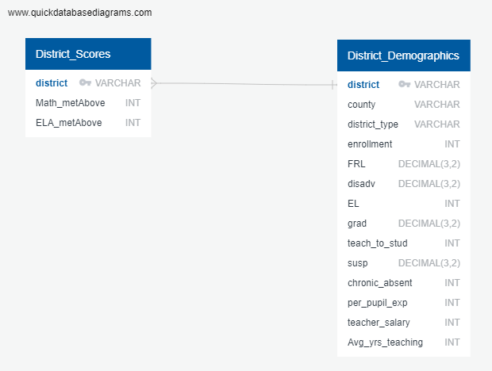

# California-School-Success

## Quick Reference

* ELA- English Language Arts (Subject taught in school comprising of phonics, reading, reading comprehension, spelling, writing)
* SBAC- Part of Smarter Balanced Summative Assessments, a standardized test based on Common Core State Standards
* FRL- Free and Reduced Lunch, part of a national initiative to provide meals to children of diverse socio-economic backgrounds

## Google Slide Presentation Draft

<https://docs.google.com/presentation/d/1F3YFfgeGMhiJDUFC4spqUofL4Du3HyZ9O8j708NnECc/edit?usp=sharing>

## Topic: Educational research

Increasing the effectiveness of our public schools has long been a strong desire for tax payers, legislators, regulators, and community stakeholders. Effectively using collected tax revenue to increase our public school performance is a strong desire of all the citizenry.

Public education reform has been the subject of ongoing legislation for decades. In California, a push for a comprehensive system to hold schools and districts accountable for their students' performance began in earnest with the passing of the Public Schools Accountability Act (PSAA)  in 1999. Similarly, in 2001 federal law known as No Child Left Behind (NCLB). In fall 2004, the California Department of Education introduced a yearly “Academic Progress Report” (APR) which combines state and federal reporting requirements.

As a group, we are deeply interested in what sorts of measurable data correlates with student success. If so, are any of those correlations predictive? Finally, what can we suggest in regards to re-structuring current districts or setting up successful ones in the future based on our findings?

## Research Questions

* What demographic, budgetary, and workforce-related variables are correlated with student success?
* How is per pupil spending distributed across California school districts?

## Variables

### Outcome/target

* Smarter Balanced Summative Assessments (SBAC) scores (one for ELA and one for Math)
* Smarter Balanced Summative Assessments (SBAC) scores (for both subjects, combined)
  * The Smarter Balanced Summative Assessments, are delivered by computer
  * Consist of two sections: a computer adaptive test and a performance task (PT) based on the Common Core State Standards (CCSS) for English Language Arts (ELA) and Mathematics. (CAASPP Description- CalEdFacts)

### Predictors/features

* Free/reduced lunch %
* Per pupil spending
* District size
* Teacher pay (average)

## Preliminary data Preprocessing

* We began by joining two tables of school district data hosted on Amazon Web Services.
* One table featured district demographics, while the other included English/Language Arts and Math test scores.
  * The tables were joined based on district name
  * Once uploaded to a Jupyter Notebook, we converted NaNs to the mean for each column, and renamed columns to eliminate spaces and abbreviate.

## Preliminary Feature Engineering and Selection

The model features were chosen because they are commonly among the most valued by major stakeholders in the education sector, including:

  1. Researchers
  2. Policymakers
  3. Journalists writing about education

We omitted features that themselves were also a sort of outcome measure of district performance, such as suspension and chronic absenteeism percentage.

We also omitted features that may be collinear with percentage of students qualifying for free/reduced price lunch (such as disadvantaged percentage).

Though we originally planned to create a linear regression model, we determined that a probability model would produce more substantive results for more audiences. Accordingly, we created binary variables for ELA and Math proficiency with a cut score of 50% proficiency. Districts with half or more of their students scoring proficient on a given exam were coded a "1", and districts with less than half were coded a "0." We chose 50% because it is a common cut score used by analysts when interpreting district performance data.

## Training and Testing Sets

We used SKLearn script for testing, training, and splitting the data. This involved use of a standard scaler to reduce the variance in feature magnitude.

* We used an 80/20 train/test split proportion, which is standard and appropriate for our dataset.

In terms of model strength, we observed that the random forest classifier had slightly better results for predicting district results for both exams.

* For predicting district ELA scores, the random forest classifier held a narrow edge in terms of accuracy score (.78) over the logistic model (.77).
* For Math scores, the random forest classifier topped the logistic model by about .2 of a score (.91 to .89).

## Model Choice

We elected to use supervised machine learning models because we have labeled outcome variables (English/Language Arts and Math test scores) that are foundational to evaluating district effectiveness. We also wanted to construct two models to determine which was more accurate based on our data. Thus, you will find both a logistic regression and forest classifier algorithm in our code base.

As mentioned above, we established probability models since it is useful to be able to predict whether a district is more or less likely (based on a set of features) to have 50% or higher students at proficiency. This is a more straightforward measure of district effectiveness than a linear model, which would only produce individual scores in relation to one another.

## Limitations

A significant limitation of probability models is, unlike linear models, we would not be able to assess which districts may be over or underperforming based on their demographics and teacher data. It may be interesting to researchers and policymakers to be able to compare predictions and actuals as a means for assessing performance. Our models - which are based on classifying binary results - would not be able to accomplish this.

## Results

<b>Description of confusion matrix and accuracy score</b>

*Logistic Regression Model confusion matrices*

English/Language Arts

Math

*Random Forest Classifier confusion matrices*

English/Language Arts

Math

*Accuracy Scores*

In terms of model strength, we observed that the random forest classifier had slightly better results for predicting district results for both exams. For predicting district ELA scores, the random forest classifier held a narrow edge in terms of accuracy score (.78) over the logistic model (.77). And for Math scores, the random forest classifier topped the logistic model by about .2 of a score (.91 to .89).

## Tableau Visualizations

<https://public.tableau.com/app/profile/patrick.holmquist/viz/CaliforniaSuccessAnalysis/TeacherSalaryvsAchievement>

## Conclusions

Family income was by far the greatest predictor of district achievement in all models. The strong association between percentage of economically disadvantaged students and district achievement was negative (i.e. a higher percentage of students in poverty was correlated with lower test scores). This finding reflects longstanding inequities in American education that show differences in educational opportunity based on class. This should prompt policymakers and education leaders to determine how schools can offset the effects of childhood poverty, even as they focus on improving instruction.

After family income, feature importance varied by model. For both logistic regression algorithms, teacher salary and per pupil expenditure were second and third, respectively. There was a moderate, positive correlation between both outcome measures and both features. This is notable - besides student demographics, the most predictive variable for district achievement has to do with budget and expenditure. Scatter plots of achievement on per pupil and teacher salary show that the magnitude of the correlations was not especially strong, signaling that though more money seems to predict better achievement, dollars by themselves may not be sufficient to improve results.

For the random forest models, there were differences in ranked importances for places 3-4. Though both the English and Math models had per pupil spending as the second most influential feature, the English model's third was teacher-to-student, while the Math's was teacher salary. Then, for the fourth place in both models, the features were reversed. The importance scores were very similar for all three variables landing from 2-4, though, so they were comparable in terms of influence. According to these models, the number of teachers in a classroom is of similar importance as the budget-related factors included.

Interestingly, average years of teaching experience was at or near the lowest importance rank in all four models. This conflicts somewhat with conventional wisdom in education, which holds that veteran teachers tend to be more effective.

## Database & Tools

Database was designed with schema in QuickDBD, then created using PostgreSQL in pgAdmin. pgAdmin is connected to an Amazon RDS instance. For easy access, data is stored in Amazon S3 as .csv files. Data was joined with SQLAlchemy in Jupyter Notebook with connection string. Additional dependencies used: Pandas, Numpy, SQLAlchemy, and SKLearn dependencies. 

## Communication Protocols

* Primary communication on Slack group 9
* Sensitive communication on Slack private message group
* Exchanged phone numbers to be used as added layer of communication. Everyone agreed that text messaging would be an acceptable form of communication.
* Set up zoom for team meetings
* Meetings held regularly on class days, including office hours on Saturday mornings, and on agreed upon dates/times as needed.

## References

CalEdFacts provides a compilation of statistics and detailed information on the California Education system.

* <https://www.cde.ca.gov/re/pn/fb/index.asp>

